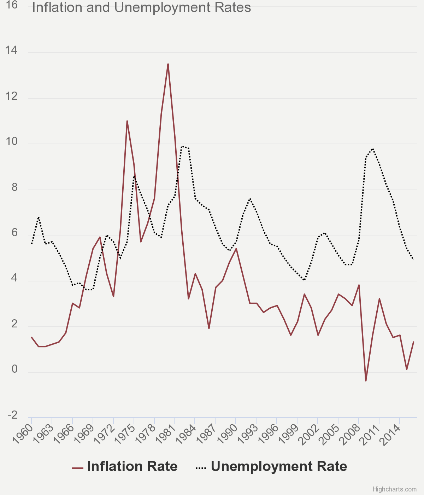

## Step one: find a data visualization (with data you can use!)
I am curious to study the relationship between between unemployment and inflation in the United States. I briefly touched on the concept of their relationship in an undergraduate economics class, and it is stated by economic experts that there should be a trade-off between unemployment and inflation. This relationship is also known as the Philips Curve. However, concepts don't always reflect real-world situations. In 1970s, there is a period of rising unemployment rate and rising inflation rate. This conflict with the proposed concept happened again from 2009 onwards. Unemployment and inflation rise together and then fall together. Therefore, it is always helpful to dig into their time series data and investigate the exact relationship.

I found a journal article [_"Does a tradeoff between inflation and unemployment exist?"_](https://www.aeaweb.org/research/inflation-unemployment-retrospectives-milton-friedman-cruel-dilemma) from American Economic Association discuss on this topic. And here is the data visualization graph the article uses to assist the reader in understanding the :

Source: Federal Reserve Bank of St. Louis

## Step two: critique the data visualization

