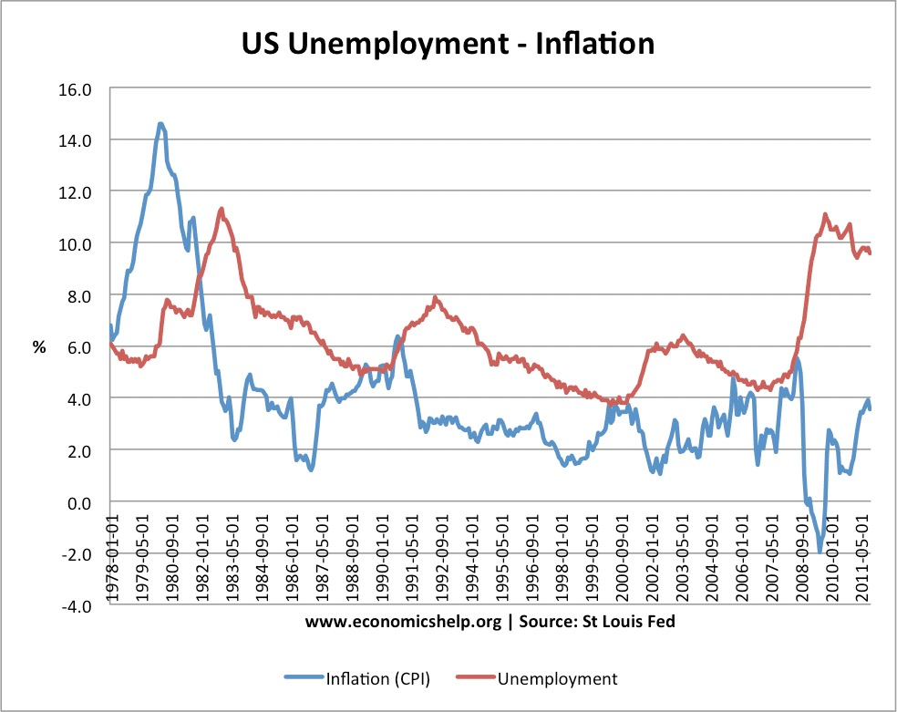

## Step one: find a data visualization (with data you can use!)
I am curious to study the relationship between unemployment and inflation in the United States. I briefly touched on the concept of their relationship in an undergraduate economics class, and it is stated by economists that there should be a trade-off between unemployment and inflation. The relationship between inflation and unemployment has historically had an inverse correlation. This hypothesized relationship is represented by the economic model, the Philips Curve. 

However, concepts cannot always reflect the more complicated real-world situations. In 1970s, there is a period of increased rate of both unemployment and inflation. This violation of the proposed inverse correlation happened again from 2009 onwards: the unemployment rate and inflation rate rise together and then fall together. Therefore, it is always helpful to dig into the time series data and investigate the trend across time.

I found a blog [_Trade off between unemployment and inflation_](https://www.economicshelp.org/blog/571/unemployment/trade-off-between-unemployment-and-inflation/) from Economics Help.org that discusses on this topic. Here is the data visualization graph from the article that is used to assist the reader in understanding the trends between inflation and unemployment:

## Step two: critique the data visualization

This section will critique the selected visualization using Stephen Few's Data Visualization Effectiveness Profile. The effectiveness of the visualization is assessed through seven criteria, which are further divided into two general categories: _informative_ (Usefulness, Completeness, Perceptibility, Truthfulness, Intuitiveness) and _emotive_(Aesthetics, Engagement). In the [spreadsheet](data_visualization_effectiveness_profile.pdf), each criteria is ranked on a scale of 1-10 where 0 being the least degree and 10 being the most degree of effectiveness. Explanations and reasonings on how I evaluated the given criteria are provided below:

### Informative
**1. Usefulness - 8**

* Is it useful for the intended audience?
  
  In general, this visualization is useful for the intended audience to understand. The audiences who browse this article are mostly attracted by the title and would like to acquire more information on this topic. Using the time-series line graph in this case is a good choice because the viewers can easily catch the changes and trends of the unemployment and inflation over time.

* Does it communicate valuable information?
  
  In terms of communicating valuable information, that's where I deducted two points from the grading scale because the visualization does not directly show off 

**2. Completeness - 8**

* Does the visualization have everything necessary to make it understandable?
  
  The data that shown on the graph are all relevant data. However, similar as the evaluation of the usefulness above 

**3. Perceptibility**
* Can the reader understand the information with minimal effort? 
* Is the visualization type appropriate?  
* Does it use illogical comparisons?

**4. Truthfulness**
* Is the visualization accurate, reliable and valid?  
* Is it representing what it says it is, and in the most complete and truthful manner? 
* Does it misrepresent the data or make comparisions that aren't correct?

**5. Intuitiveness**
* Is it easy to understand and clearly communicates the information? 
* If unfamiliar, does it include easy to understand instructions on how to interpret it?

### Emotive
**6. Aesthetics**
* It is interesting / enjoyable to look at?  
* Is it a good example of what a beautiful data visualization might look like?  
* Is it somewhere in the middle - pleasing but otherwise not distracting to look at?

**7. Engagement**
* Does it lead the audience to learn more about the topic?  
* Does it inspire the audience to talk about the data or share it with others?

### Overall observations about the data visualization**  
* What stood out to you?  
* What did you find worked really well?  
* What didn't?  
* What, if anything, would you do differently? 

### Audience Analysis
* Who is the primary audience for this tool?  
* Do you think this visualization is effective for reaching that audience?  
* Why or why not?

### Final thoughts: 
* How successful what this method at evaluating the data visualization you selected? 
* Are there measures you feel are missing or not being captured here?  
* What would you change?  Provide 1-2 recommendations (color, type of visualization, layout, etc.)
