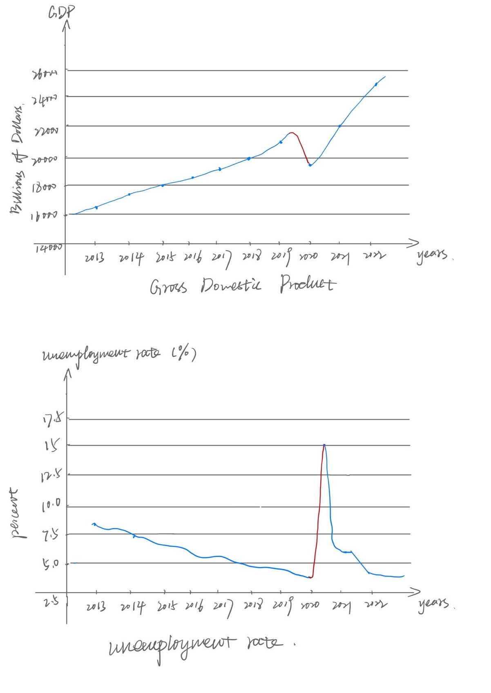
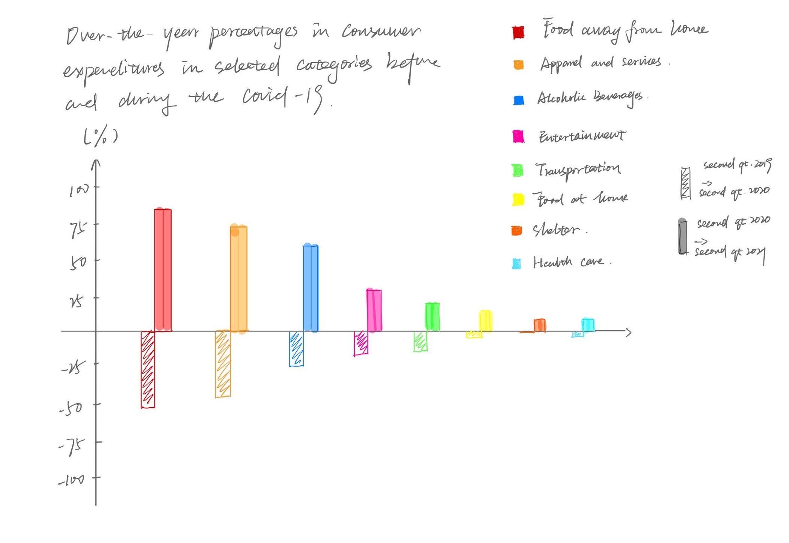

| [home page](https://yilinc09.github.io/tswd-portfolio/) | [visualizing debt](https://yilinc09.github.io/tswd-portfolio/visualizing-government-debt.html) | [critique by design](https://yilinc09.github.io/tswd-portfolio/critique-by-design.html) | [final project I](https://yilinc09.github.io/tswd-portfolio/final-project-yilincao.html) | [final project II](https://yilinc09.github.io/tswd-portfolio/final-project-part-two.html) | [final project III](final-project-part-three) |

## An outline

#### Summary

**How COVID-19 has changed consumer spending habits**

The COVID-19 pandemic has significantly impacted the global economy, resulting in widespread job losses, business closures, and decreased consumer spending. Due to this disruption of supply chains, economic uncertainty, and lower consumer confidence, there have been unprecedented challenges. Personally, I have noticed an increase in my online shopping habits in recent years, which sparked my curiosity to investigate the changes in consumer spending habits resulting from the pandemic. I intend to explore the underlying reasons for this shift, in addition to identifying the sectors that have been most affected by the pandemic and those that have managed to adapt effectively to the new circumstances.

The primary target audience for this project is the master's students at Heinz College, Carnegie Mellon University. The project seeks to demonstrate how consumer spending patterns have changed in response to the pandemic across various categories, with a particular emphasis on the shifts that have occurred during 2020.

#### Project Structure
- Background: shows how COVID-19 has a devastating impact on the global economy, such as GDP declines, and rise in unemployment rate.
- Identify key trends: Analyze data on consumer spending patterns before and during the pandemic. Look for changes in spending categories, such as a decrease in spending on travel and dining out and an increase in spending on home improvement and online shopping.
- Explore the reasons behind the trends: Investigate why these changes in spending occurred. For example, the decrease in travel spending could be due to travel restrictions and safety concerns, while the increase in home improvement spending could be due to more time spent at home and a desire to improve living conditions.
- Highlight the impact on different groups: Consider how different demographic groups have been affected by the changes in spending habits. For instance, low-income households may have been more affected by job loss and income reduction, which may have led to changes in their spending habits.
- Connect the dots: Use the data and insights to tell a compelling story about how COVID-19 has impacted consumer spending habits. Show how these changes have affected the economy, businesses, and individuals.

## Initial sketches

## The data

- Data Source 1: [Opportunity Insights (OI)](https://opportunityinsights.org/data/)
  
  From this data source I access the [Consumer Spending Data National](https://github.com/OpportunityInsights/EconomicTracker/blob/main/data/Affinity%20-%20National%20-%20Daily.csv) that tracks consumer daily spending across categories of goods and services in the US. The data is collected from credit and debit card transactions.

- Data Source 2: [U.S Bureau of Labor Statistics](https://www.bls.gov/)
  
  BLS collects data on household spending from [Consumer Expenditure Survey (CEX)](https://www.bls.gov/cex/data.htm) on a wide range of goods and services, including food, housing, transportation, healthcare, and entertainment. The CEX data provides detailed information on the amount and distribution of household spending. I will use this source to compare the spending habits of different demographic groups.
  
- Data Source 3: [FRED Economic Data](https://fred.stlouisfed.org/)
  
  From this source I collect the data to show the trend of [GDP](https://fred.stlouisfed.org/series/GDP) and [unemployment rates](https://fred.stlouisfed.org/series/UNRATE) during COVID-19.
  
- Data Source 4: E-commerce data
  
  The sales data of E-commerce platforms such as Amazon, Zara, L'oreal, etc.

## Method and medium

To finish the final project, I plan to build up the story presented in the previous section using Shorthand by integrating relevant data visualizations and images. The visualizations will mainly be developed using Flourish, with the possibility of using Tableau if it proves to be a more appropriate tool for some of the visualizations. I will also search for appealing images on Unsplash to enhance the narrative and make it more impactful.
